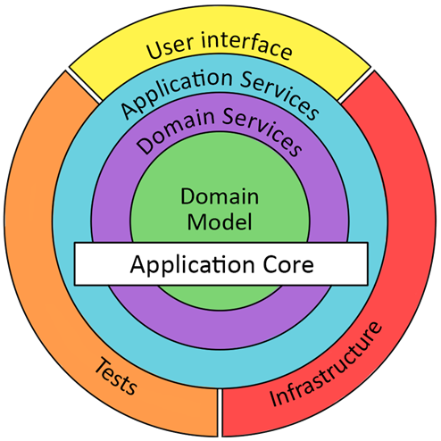

### Domain Driven Design

* Domain Core: business model and logic. Independent of any external frameworks or libraries
    * Entity: A business object, containing attributes and business logic methods that only operate on this one entity.
    * Value Object: Immutable business object, which can aggregated or composed in to an Entity.
    * Aggregate: A group (or tree) of entities that are always guaranteed to be in a consistent state
    * Aggregate Root: The entity that is used as the handle for the aggregate. All external operations are performed via
      this root
    * Domain Service: Business logic methods that operate on multiple aggregates, or when the logic does not fit in to
      any entity cleanly.
    * Domain Event: Represents an occurrence that has occurred in the domain, which needs to be communicated to other
      systems
* Application Service:
    * Connects domain logic to the infrastructure and platform
    * Orchestrates transactions, security, persistence, messaging
    * Does NOT contain business logic

### Modules

* TODO

### Packages

* TODO

### Events / Messages

* Avro model: change management and backward / forward compatibility

### Libraries

* We accept the following very basic and common library dependencies in our Domain Core submodules:
    * Lombok
    * Apache Commons
    * Google Guava
    * Slf4j

## Testing

### Unit Testing

* Tests a single class
* Cover all the edge cases you can think of, including invalid input and error conditions
* Assert all output, including error and exception messages
* Implemented with Spock and Groovy. Where Spock introduces unnecessary issues, fall back to JUnit 5
* Mock all class dependencies
* Assertions are done using Spock or Hamcrest

### Business Unit Testing

* Tests the business logic in the Domain Core
* Multiple test per use-case
    * as many edge-cases as possible
    * expected error conditions
* Assert all output that is salient for the use-case and edge-case
* BDD: Implemented with Cucumber in Gherkin

### Integration Testing

* Tests a single running executable
* Proves that the full ecosystem of classes works together as intended
* Few (minimum 1) tests per use-case
    * the most common expected input
    * expected error conditions
* Assert all output that is salient for the use-case
* Implemented with JUnit 5
* Mock all external system dependencies, including REST client, messaging and database

### E2E Testing

* Tests the fully deployed and running set of microservices and infrastructure, including messaging and DB
* Uses a curated database and a set of instrumented data constellations
* Smoke-tests only, no full coverage of use-cases
* Best case: includes the UI, driven by an automated testing tool like Selenium

### Performance Testing

* TODO

### Code style

* KISS, YAGNI
* Prefer Builder pattern (and where applicable Fluent Interface pattern) over constructors
* Naming
    * Do not use abbreviation, except where it is a standard acronym in the domain or the technology
    * Use verbose naming as much as possible, but don't repeat redundant elements of a name if it's clear from the
      context
* Immutable variables, parameters and attributes are the default. We need good arguments to make anything mutable.
* Minimise visibility of classes, attributes and methods as much as possible
* Avoid method and operator nesting
* The ternary operator is only used in extremely simple expressions
* Keep methods small - we need good arguments to allow more than 10 lines
* Use typed RuntimeExceptions
* Make full use the features of the language:
    * Optional
    * Streams
    * Local type inference (var). The type of the variable must be clear from the context, if not then use explicit type
* Use Lombok and MapStruct to avoid boilerplate as much as possible, but don't introduce complexity to allow their use.
* Do not log an error and then throw an exception. The exception should contain all the required context information,
  and it should be logged when it is caught. Logging before throwing the exception just causes the same error to be
  logged twice.