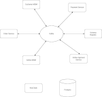
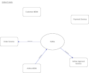
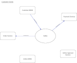
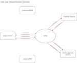

[![Contributors][contributors-shield]][contributors-url]
[![Forks][forks-shield]][forks-url]
[![Stargazers][stars-shield]][stars-url]
[![Issues][issues-shield]][issues-url]
[![License][license-shield]][license-url]
[![LinkedIn][linkedin-shield]][linkedin-url]

# Microservice Showcase

## About

This is a showcase and template for a microservices project, based on the principles of DDD and Hexagonal Architecture.
It is intended to serve as an example, and a starting point for a green-field project. The goal is to solve as many of
the technical integration issues as possible up front, allowing the project to focus on domain modelling and business
implementation.

This is a fully integrated and running project, complete with mainstream architecture, design patterns, data migration
(Liquibase), build integration (Gradle) and test examples. Core domain model and business logic are fully separated from
technical and infrastructure integration concerns, which does complicate the project organisation somewhat, but in
return provides a modular, maintainable and testable code base. It also prevents technology tie-in and makes BDD-style
testing easy.

Communication is implemented using REST for external APIs, and asynchronous messages over Kafka internally between the
microservices. 2 communication patterns are shown: CQRS and Saga Flows. The Kafka integration is based on Spring Kafka
and Avro/Schema Registry, and uses retries with exponential backoff and DLQs to achieve robustness. Resilience is shown
using end-to-end tests that kill and then restart components of the infrastructure, and assert that no messages have
been lost.

The microservices are implemented using Java 17, Spring Boot and common libraries to reduce boilerplate. REST APIs are
specified using OpenAPI 3 (API first) and the client stubs and server skeletons are generated using the OpenApi
generators.

4 different kinds of tests are shown: Spock Unit tests, Cucumber BDD business logic/domain tests, Integration tests and
End-to-End tests. Test coverage is enforced with JaCoCo. Integration tests use TestContainers to run the infrastructure
and microservice containers locally, with lifecycles that are managed by custom JUnit5 extensions.

SwaggerUI is provided for spec and testing purposes, served by a separate, independent microservices for each REST API.

Static code analysis is integrated using Checkstyle, PMD, Spotbugs and Codenarc, and preconfigured to provide a strict
but realistic starting point. Having these standards defined and enforced from the outset will prevent a lot of the
technical debt that often builds up at the start of a project, while these things are sorted out.

Authentication is provided by Keycloak and integrated in the Spring microservices using Spring Security JWT.

### Built With

[![Java][Java-shield]][Java-url]
[![Spring Boot][SpringBoot-shield]][SpringBoot-url]
[![Kafka][Kafka-shield]][Kafka-url]
[![OpenAPI][OpenAPI-shield]][OpenAPI-url]
[![Docker][Docker-shield]][Docker-url]
[![Liquibase][Liquibase-shield]][Liquibase-url]
[![Lombok][Lombok-shield]][Lombok-url]
[![Mapstruct][Mapstruct-shield]][Mapstruct-url]
[![Google Guava][Google-Guava-shield]][Google-Guava-url]
[![Avro][Avro-shield]][Avro-url]
[![Slf4j][Slf4j-shield]][Slf4j-url]

#### Tested with

[![JUnit][JUnit-shield]][JUnit-url]
[![Groovy][Groovy-shield]][Groovy-url]
[![Spock][Spock-shield]][Spock-url]
[![Cucumber][Cucumber-shield]][Cucumber-url]
[![Testcontainers][Testcontainers-shield]][Testcontainers-url]
[![Mockito][Mockito-shield]][Mockito-url]
[![Hamcrest][Hamcrest-shield]][Hamcrest-url]
[![Awaitility][Awaitility-shield]][Awaitility-url]
[![Swagger-UI][Swagger-UI-shield]][Swagger-UI-url]

#### CI/CD

[![Gradle][Gradle-shield]][Gradle-url]
[![Checkstyle][Checkstyle-shield]][Checkstyle-url]
[![PMD][PMD-shield]][PMD-url]
[![SpotBugs][SpotBugs-shield]][SpotBugs-url]
[![JaCoCo][JaCoCo-shield]][JaCoCo-url]
[![Codenarc][Codenarc-shield]][Codenarc-url]
[![GradleLint][GradleLint-shield]][GradleLint-url]

## Topology

5 Microservices which communicate with each other via Kafka and with the outside world via REST APIs.
Each microservice has a PostgreSQL Schema for data storage, and the 3 microservices with REST APIs use KeyCloak for
authentication.

Swagger-UI interfaces are provided for the 3 REST APIs. These run in their own containers and delegate to the REST APIs.

## Use Case

Very simple, 5 microservices are implemented:

|                          |                              |
|--------------------------|------------------------------|
| airline-mdm              | Airline Master Data Manager  | 
| customer-mdm             | Customer Master Data Manager |
| order-service            | Order Service                |
| payment-service          | Payment Service              |
| airline-approval-service | Airline Approval Service     |

The Master Data Manager services are used for master data ingress through REST APIs. They act as Primary data owners,
and they generate Domain Events that are consumed by the other services for data replication.

The Order service exposes a REST API which allows the user to place an order. It acts as the Orchestrator for a Saga
Flow, which first requests payment from the Payment Service and then requests approval for the Order from the Airline.

## Implementation

While the use-case is rudimentary, the implementations should be clean enough to serve as an example.

All Gradle plugins are fully integrated and configured, including Spring, OpenAPI Generator, Avro Generator, Liquibase,
Checkstyle, PMD, Spotbugs, Jacoco, Groovy, Codenarc and Spock.

The latest available versions of the component frameworks and libraries are used as much as possible.

The project is not fully fleshed out with modelling, business logic and tests - it's intended as a showcase, as a
reference, and as a template for new projects.

## Usage

See [USAGE.md](docs/USAGE.md) for instructions on how to run the microservices.

See the following documentation for more information:

- [ARCHITECTURE.md](docs/ARCHITECTURE.md)
- [PROJECT_ORGANISATION.md](docs/PROJECT_ORGANISATION.md)
- [CODING_STANDARDS.md](docs/CODING_STANDARDS.md)
- [REST_API.md](docs/REST_API.md)
- [DATABASE.md](docs/DATABASE.md)
- [MESSAGING.md](docs/MESSAGING.md)
- [SECURITY.md](docs/SECURITY.md)
- [TESTING.md](docs/TESTING.md)
- [BUILD.md](docs/BUILD.md)

<!-- MARKDOWN LINKS & IMAGES -->
<!-- https://www.markdownguide.org/basic-syntax/#reference-style-links -->

[contributors-shield]: https://img.shields.io/github/contributors/adam-crowther/microservice-starter.svg?style=for-the-badge

[contributors-url]: https://github.com/adam-crowther/microservice-starter/graphs/contributors

[forks-shield]: https://img.shields.io/github/forks/adam-crowther/microservice-starter.svg?style=for-the-badge

[forks-url]: https://github.com/adam-crowther/microservice-starter/network/members

[stars-shield]: https://img.shields.io/github/stars/adam-crowther/microservice-starter.svg?style=for-the-badge

[stars-url]: https://github.com/adam-crowther/microservice-starter/stargazers

[issues-shield]: https://img.shields.io/github/issues/adam-crowther/microservice-starter.svg?style=for-the-badge

[issues-url]: https://github.com/adam-crowther/microservice-starter/issues

[license-shield]: https://img.shields.io/github/license/adam-crowther/microservice-starter.svg?style=for-the-badge

[license-url]: https://github.com/adam-crowther/microservice-starter/blob/master/LICENSE.md

[linkedin-shield]: https://img.shields.io/badge/-LinkedIn-black.svg?style=for-the-badge&logo=linkedin&colorB=555

[linkedin-url]: https://www.linkedin.com/in/adam-crowther-5a51564/

[Java-shield]: https://img.shields.io/badge/Java%2017-e76f00?style=for-the-badge

[Java-url]: https://spring.io/projects/spring-boot

[SpringBoot-shield]: https://img.shields.io/badge/Spring%20Boot-6db33f?style=for-the-badge

[SpringBoot-url]: https://spring.io/projects/spring-boot

[Kafka-shield]: https://img.shields.io/badge/Kafka-000000?style=for-the-badge

[Kafka-url]: https://kafka.apache.org/documentation

[OpenAPI-shield]: https://img.shields.io/badge/OpenApi-76c513?style=for-the-badge

[OpenAPI-url]: https://openapi-generator.tech/

[Docker-shield]: https://img.shields.io/badge/Docker-0b214a?style=for-the-badge

[Docker-url]: https://docs.docker.com/

[Liquibase-shield]: https://img.shields.io/badge/Liquibase-0000ff?style=for-the-badge

[Liquibase-url]: https://docs.liquibase.com/home.html

[Lombok-shield]: https://img.shields.io/badge/Lombok-626980?style=for-the-badge

[Lombok-url]: https://projectlombok.org/

[Mapstruct-shield]: https://img.shields.io/badge/Mapstruct-e94e1b?style=for-the-badge

[Mapstruct-url]: https://mapstruct.org/

[Google-Guava-shield]: https://img.shields.io/badge/Google%20Guava-8fc43e?style=for-the-badge

[Google-Guava-url]: https://github.com/google/guava

[Avro-shield]: https://img.shields.io/badge/Avro-30638e?style=for-the-badge

[Avro-url]: https://avro.apache.org/docs/

[Slf4j-shield]: https://img.shields.io/badge/Slf4j-ffd0a0?style=for-the-badge

[Slf4j-url]: https://www.slf4j.org/

[JUnit-shield]: https://img.shields.io/badge/JUnit-2d5fd2?style=for-the-badge

[JUnit-url]: https://junit.org/junit5/

[Groovy-shield]: https://img.shields.io/badge/Groovy-286b86?style=for-the-badge

[Groovy-url]: https://groovy-lang.org/documentation.html

[Spock-shield]: https://img.shields.io/badge/Spock-08e?style=for-the-badge

[Spock-url]: https://spockframework.org/spock/docs

[Cucumber-shield]: https://img.shields.io/badge/Cucumber-1dbb68?style=for-the-badge

[Cucumber-url]: https://cucumber.io/docs/cucumber

[Mockito-shield]: https://img.shields.io/badge/Mockito-78a540?style=for-the-badge

[Mockito-url]: https://site.mockito.org/

[Hamcrest-shield]: https://img.shields.io/badge/Hamcrest-b07219?style=for-the-badge

[Hamcrest-url]: https://hamcrest.org/

[Awaitility-shield]: https://img.shields.io/badge/Awaitility-a40000?style=for-the-badge

[Awaitility-url]: http://www.awaitility.org/

[Testcontainers-shield]: https://img.shields.io/badge/Testcontainers-291A3F?style=for-the-badge

[Testcontainers-url]: https://www.testcontainers.org/

[Swagger-UI-shield]: https://img.shields.io/badge/Swagger%20UI-63db2a?style=for-the-badge

[Swagger-UI-url]: https://swagger.io/tools/swagger-ui/

[Gradle-shield]: https://img.shields.io/badge/Gradle-02303A?style=for-the-badge

[Gradle-url]: https://docs.gradle.org/current/userguide/userguide.html

[Checkstyle-shield]: https://img.shields.io/badge/Checkstyle-777?style=for-the-badge

[Checkstyle-url]: https://checkstyle.org/

[PMD-shield]: https://img.shields.io/badge/PMD-bcd6c9?style=for-the-badge

[PMD-url]: https://docs.pmd-code.org/latest/

[SpotBugs-shield]: https://img.shields.io/badge/SpotBugs-2e7bcf?style=for-the-badge

[SpotBugs-url]: https://spotbugs.readthedocs.io/en/latest/gradle.html

[JaCoCo-shield]: https://img.shields.io/badge/JaCoCo-darkgreen?style=for-the-badge

[JaCoCo-url]: https://www.jacoco.org/jacoco/trunk/doc/

[Codenarc-shield]: https://img.shields.io/badge/Codenarc-991b1e?style=for-the-badge

[Codenarc-url]: https://codenarc.org/

[GradleLint-shield]: https://img.shields.io/badge/GradleLint-292929?style=for-the-badge

[GradleLint-url]: https://github.com/nebula-plugins/gradle-lint-plugin

