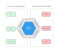

# Domain Driven Design

Domain-Driven Design (DDD) is an approach to software development that focuses on understanding and modeling the domain
or problem space of a business or organization.

## Core principles

### Ubiquitous Language

Establishing a common language or vocabulary that is shared by all stakeholders, including business experts, domain
specialists, and developers. This language should be used consistently in all communications and artifacts, such as
code, documentation, and conversations.

### Model-Driven Design

A domain model is a representation of the key concepts, relationships, and behaviors within the domain, and it serves
as a shared understanding between domain experts and developers. The model is continuously refined and evolved based on
feedback from the domain experts and as the understanding of the domain deepens.

### Bounded Contexts

Specific, self-contained areas within the domain that have a clear boundary and a well-defined context. Each bounded
context has its own domain model, language, and design, and is loosely coupled with other bounded contexts. Bounded
contexts help manage complexity and enable independent development and deployment of different parts of the system.

### Context Maps

Relationships and interactions between bounded contexts are mapped explicitly. Context mapping involves identifying
and defining the ways in which different bounded contexts collaborate, share information, and maintain consistency. It
helps uncover areas of potential conflict or misalignment and facilitates communication and coordination between teams
working on different bounded contexts.

### Design Patterns

Ensure that the software design is aligned with the domain and promotes maintainability, flexibility, and scalability.

- Domain Model: Entity, Aggregate, Value Object, Event, etc.
- Domain Logic: Factory, Repository, Domain Service, Application Service
- Onion/Layered Architecture: Domain Core, Infrastructure, Presentation

### Continuous Learning

Our understanding of the domain and requirements evolve over time, which is why DDD encourages the use of an iterative
approach to development and design.

Overall, DDD promotes a collaborative and iterative approach to software development, where the domain experts and
developers work closely together to create a software system that reflects the complexity and richness of the domain,
and supports the needs of the business.

# Onion Architecture

Dependencies point inward, toward the center of the onion. 

## Domain Core

- Implemented in the `xxxx-domain-core` submodule of a microservice.
- Contains the business model and business logic code.
- Must be independent of any external frameworks or libraries. No Spring, database, messaging or any other external
  dependencies.
- The only exceptions to this rule are that we accept a couple of very common libraries for the purpose of reducing
  boilerplate and enabling clean code:  Slf4j, Lombok, Google Guava and Apache Commons Lang.

### Domain Model Layer

- Entity: A business object, containing attributes and business logic methods that only operate on this one
  entity.
- EntityId:
  [Tiny-Types](https://techbeacon.com/app-dev-testing/big-benefits-tiny-types-how-make-your-codes-domain-concepts-explicit)
  that encapsulate the ID of an Entity. E.g. CustomerId, AirlineId, OrderId. We like Tiny-Types, even though they are
  not well-supported by Java.
- Value Object: Immutable business object without an identity, which can aggregated or composed in to an Entity.
- Aggregate: A group (or tree) of entities that are always guaranteed to be in a consistent state.
- Aggregate Root: The entity that is used as the handle for the aggregate. _All external operations are performed
  via this root._
- Domain Service: Business logic methods that operate on multiple aggregates, or when the logic does not fit in
  to any entity cleanly.
- Domain Event: Represents an occurrence in the Domain, which needs to be communicated to
  other systems.

### Domain Services Layer

- Provides business logic that works with multiple Aggregates.
- Where business logic operates on a single aggregate, it can be coded in the Entities directly.
- Some developers prefer to interact with the Domain Model through Domain Services even when there is no logic across
  Aggregate Boundaries. This might feel cleaner, but it comes at the cost of more (unnecessary) code to maintain.

## Application Services Layer

- Implemented in the `xxxx-application-service` submodule of a microservice.
- Glue that connects domain logic to the infrastructure and platform.
- Provides the Java Interfaces that allows the integration of external infrastructure using Spring Beans and IOC with
  injection.
- Orchestrates transactions, security, persistence, messaging.
- Does **not** contain business logic
- External API is defined using DTOs. _We don't expose our Domain model to the outside._  Possible exception: Enums.

## User Interface Layer

- Represented by the `xxxx-presentation` submodule of a microservice:
    - `xxxx-api-spec` with the openapi.yaml
    - `xxxx-rest-controller` which implements the Spring REST controller
- Invokes the Application Service.

## Infrastructure Layer

- `xxxx-infrastructure` submodule of a microservice, containing `xxxx-data-access` and `xxxx-messaging`.
- Implements the input and output port interfaces, which are injected in to the Application Services layer by Spring
  IOC.

# Hexagonal Architecture

- Isolates the Domain code from Infrastructure dependencies using  `Ports` & `Adapters`:  Domain defines `Ports` as
  Interfaces, Infrastructure provides dependencies as `Adapters`.
- By implementing different Adapters for a given Input Port, we can 'drive' the Domain logic from different front-ends,
  e.g. REST, CLI or Tests.
- Integration Tests are implemented by mocking the Output Ports.
- See:
    - https://alistair.cockburn.us/hexagonal-architecture/
    - https://medium.com/ssense-tech/hexagonal-architecture-there-are-always-two-sides-to-every-story-bc0780ed7d9c
- Similar to Uncle Bob's Clean Architecture:
  https://blog.cleancoder.com/uncle-bob/2012/08/13/the-clean-architecture.html

# Saga Pattern

A design pattern that is used in distributed systems to manage long-lived transactions that span multiple microservices
or bounded contexts.

- Manages data consistency across microservices in distributed transaction scenarios.
- Models complex workflows with multiple steps or decision points.
- A Saga is a chain of local transactions that updates each service in sequence and publishes a message or event to
  trigger the next transaction step.
- Leverages event-driven architecture and domain events for coordination.
- Each step in the Saga is implemented by a request message and one or more response messages, and by a local ACID
  transaction.
- Errors are handled by Rollbacks: compensating local ACID transactions which reverse the effect of a previous event in
  the Saga.
- Exception handling: unexpected exceptions in Saga request listeners are handled by sending a corresponding semantic
  response message. Eg if the Request is `PaymentRequestMessage` then the exception handler should log the error and
  send a `PaymentFailedResponseMessage`.

> Important: We do **not** allow microservices to cascade a request to more requests to other microservices. Cascading
> requests generate exponential complexity in the asynchronous message API design and error handling, and when things
> go wrong they make troubleshooting extremely difficult.

# CQRS - Command Query Responsibility Segregation

- For each Entity, we define a 'Master' (="**Command**") microservice that is allowed to change that entity.
- We are strict that there can only be one 'Master' microservice for each Entity.
- All other microservices can only perform read operations (="**Query**").
- Each Microservice can only access its own data repository. No Microservice can access the data repository of another
  microservice across the domain boundary.
- Data entities are 'replicated' across the domain boundaries (ie from the data repository of a 'Master'
  microservice to that of the other microservices) through _Entity Domain Events_.
- Each microservice therefore has a data entity model which is divided into two parts: 'Master Data' and 'Replicated
  Data'.
- Microservices listen on Entity Domain Event topics, and maintain a local store of the required entities and
  attributes.
- Exception handling: unexpected exceptions in the Entity Domain Event listeners are handled by the standard Spring
  retry mechanism, with exponential backoff. (`DefaultErrorHandler` with `ExponentialBackOffWithMaxRetries`
  and `DeadLetterPublishingRecoverer`). The behaviour is configurable - e.g. max 3 retries, with a delay that
  starts at 10 seconds, and doubles with each attempt. If all retries fail, then the message is forwarded to a dead
  letter queue, which is has the same name as the original topic, with an added suffix (e.g. '-dlt').
- Entity Domain Events follow the `Kafka Streams KTable`/`KSQL query` conventions:
    - The message key is the Entity's unique numeric primary key.
    - The message is serialised using Avro and the Schema is validated using Schema Registry.
    - The message value contains the Entity's full schema, including all attributes, id and version, and including the
      audit createdTimestamp and lastModified Timestamp from the Master database. For security reasons, it does NOT
      include the createdBy and lastModifiedBy data, however these could easily be added to the event model if required.
    - By following the Kafka Streams KTable/KSQL query conventions, we have the option of implementing a Kafka
      Streams application that could transform or join streams for consumption by a microservice. 
