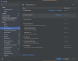
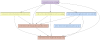

# Gradle Setup & Tasks

We use Gradle Version 7.5.1, using the Gradle Wrapper.

## Basic tasks

|         | Gradle command               | Task dependencies                   |
|---------|------------------------------|-------------------------------------|
| Clean   | `gradle clean`               | -                                   |
| Compile | `gradle classes testClasses` | -                                   |
| Package | `gradle jar`                 | Compile                             |
| Test    | `gradle test`                | Compile                             |
| Check   | `gradle check`               | Compile, Static code analysis, Test |
| Build   | `gradle build`               | Pompile, Package, Check             |

## OpenApi

2 tasks: validate the openapi.yaml file, and generate the stubs and skeletons in to: `build/generated/src/main/java`.
This target directory is included in the sourceSet for the submodules that depend on the generated code.

|          | Gradle command           | Task dependencies |
|----------|--------------------------|-------------------|
| Validate | `gradle openApiValidate` | -                 |
| Generate | `gradle openApiGenerate` | Compile           |

## Liquibase

Here we use 2 tasks:

- Generate a full Changelog from the JPA entity notations, containing the full database schema as a YAML file in the
  Liquibase database-agnostic
  notation.
- Generate a DIFF Changelog, comparing the JPA entity notations with the current Changelog in the `resources` folder.

Changelogs are generated to `build/liquibase/`, and are only intended to serve as a starting point for database
migration scripts. They need to be checked for correctness and updated manually to meet coding standards before being
integrated in the `resources` folder.

|                    | Gradle command                      | Task dependencies            |
|--------------------|:------------------------------------|------------------------------|
| Generate Changelog | `gradle liquibaseGenerateChangelog` | Compile, Package             |
| Diff Changelog     | `gradle liquibaseDiffChangelog`     | Compile, Package, Compose Up |

Uses Docker Compose to start up a clean PostgreSQL database.

## Static code analysis

- All static code analysis tasks are triggered by the `gradle check` task.
- All failures should break the build and prevent PRs from being merged.

### Checkstyle

- Our code style is loosely based on the Google style, with some modifications to make it more readable, more lenient
  and easier to conform.
- See https://checkstyle.sourceforge.io/
- Checkstyle is configured in the file: [checkstyle.xml](../config/checkstyle.xml)
- Please load the Intellij [Intellij_codestyle_java.xml](../config/Intellij_codestyle_java.xml), which will implement
  the rules that are enforced by Checkstyle.

|                  | Gradle command          | Task dependencies |
|------------------|:------------------------|-------------------|
| Analyse src/main | `gradle checkstyleMain` | Compile           |
| Analyse src/test | `gradle checkstyleTest` | Compile           |

### PMD

- Static code analyser that finds common simple flaws, like unused variables, empty catch blocks, unnecessary object
  creation, etc.
- See https://docs.pmd-code.org/latest/
- PMD is configured in the file: [pmd_rules.xml](../buildSrc/src/main/resources/pmd_rules.xml)
- Configure `Actions On Save` in Intellij to enforce our coding standards, as follows:
  

|                  | Gradle command   | Task dependencies |
|------------------|:-----------------|-------------------|
| Analyse src/main | `gradle pmdMain` | Compile           |
| Analyse src/test | `gradle pmdTest` | Compile           |

### Spotbugs

- Static code analyser that looks for common "bug patterns":
    - Bad practices
    - Coding mistakes
    - Malicious code
    - Random noise
    - Performance issues
    - Security issues
    - Confusing code.
- See https://spotbugs.readthedocs.io/en/latest/
- Spotbugs is configured in the exclusion file: [spotbugs_exclude.xml](../buildSrc/src/main/resources/spotbugs_exclude.xml)

|                  | Gradle command        | Task dependencies |
|------------------|:----------------------|-------------------|
| Analyse src/main | `gradle spotbugsMain` | Compile           |
| Analyse src/test | `gradle spotbugsTest` | Compile           |

### JacCoCo

- Test coverage: reporting and enforcement
- See https://www.eclemma.org/jacoco/
- The plugin is configured to fail the build if coverage is less than 95%.
- Reports are generated in `build/reports/jacoco`
- JaCoCo is configured in the file: [jacoco.gradle](../config/jacoco.gradle)

|                          | Gradle command            | Task dependencies |
|--------------------------|:--------------------------|-------------------|
| Generate the HTML report | `gradle jacocoTestReport` | Compile Test      |

### Gradle Lint

- Gradle Lint checks the gradle setup for wrong configuration, deprecation and unused dependencies.
- See https://github.com/nebula-plugins/gradle-lint-plugin/wiki
- We only run gradleLint as a dependency of the check task, not for every build.
- Use the `generateGradleLintReport` task to find which submodule is generating a lint error.
- Do NOT run `fixGradleLint` to apply fix changes automatically.
- GradleLint is configured directly in the gradle build file: [gradlelint.gradle](../config/gradlelint.gradle)

|                  | Gradle command                    | Task dependencies |
|------------------|:----------------------------------|-------------------|
| Run Lint         | `gradle gradleLint`               | -                 |
| Generate Reports | `gradle generateGradleLintReport` | -                 |

## Graphfity

- Graphfity is a tool that generated dependency diagrams like this one:
  
- See https://github.com/ivancarras/graphfity
- It generates a PNG in the container's build folder: `build/project.dot.png`
- Graphfity is configured in each container submodule, in the file
  [graphfityNodeTypes.json](..%2Fcustomer-service%2Fcustomer-container%2FgraphfityNodeTypes.json).

|                                       | Gradle command                                          | Task dependencies |
|---------------------------------------|:--------------------------------------------------------|-------------------|
| Generate graph for Airline Container  | `gradle :airline-service:airline-container:graphfity`   | -                 |
| Generate graph for Customer Container | `gradle :customer-service:customer-container:graphfity` | -                 |
| Generate graph for Order Container    | `gradle :order-service:order-container:graphfity`       | -                 |
| Generate graph for Payment Container  | `gradle :payment-service:payment-container:graphfity`   | -                 |

## Spring Boot

- Spring Boot Gradle plugin, providing multiple capabilities:
    - Packaging executable JAR archives that can be run with java -jar
    - Run the application locally
    - Publish the application to a Maven Repository like Nexus or Artifactory
    - Create a Docker image containing the Spring application (we don't use this)
    - Dependency Management (we don't use this)
- See https://docs.spring.io/spring-boot/docs/current/gradle-plugin/reference/htmlsingle/

|                                | Gradle command                                        | Task dependencies |
|--------------------------------|:------------------------------------------------------|-------------------|
| Package the Airline Container  | `gradle :airline-service:airline-container:bootJar`   | -                 |
| Run the Airline Container      | `gradle :airline-service:airline-container:bootRun`   | -                 |
| Package the Customer Container | `gradle :customer-service:customer-container:bootJar` | -                 |
| Run the Customer Container     | `gradle :customer-service:customer-container:bootRun` | -                 |
| Package the Order Container    | `gradle :order-service:order-container:bootJar`       | -                 |
| Run the Order Container        | `gradle :order-service:order-container:bootRun`       | -                 |
| Package the Payment Container  | `gradle :payment-service:payment-container:bootJar`   | -                 |
| Run the Payment Container      | `gradle :payment-service:payment-container:bootRun`   | -                 |

